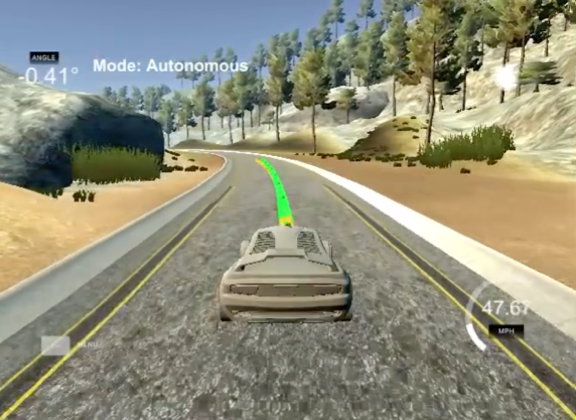

# CarND-Controls-MPC
Self-Driving Car Engineer Nanodegree Program

---

## Overview



[Link to recording](https://youtu.be/bFIMydrKyGk)

The goal of this project is to control the car's steering angle and acceleration to keep it in the track using model predictive control (MPC). The controller which is implemented in C++ communicates with the simulator developed by Udacity. It is designed to handle 100ms latency in the system. 

## Vehicle Model

A simple kinematic vehicle model has been implemented in this project. 

### Vehicle State

The vehicle's state is defined by

* `x` and `y` : Position of the car
* `psi` : Car's orientation
* `v` : Car's velocity
* `cte` : Cross track error
* `epsi` : Orientation error

### Controls 

There are two actuators in this model

* `delta` : steering angle (radians)
* `a` : acceleration

### Model Update Equations

The basic state update equations are: 

* `x2 = x1 + v1 * cos(psi1) * dt`
* `y2 = y1 + v1 * sin(psi1) * dt`
* `v2 = v1 + a * dt`
* `psi2 = psi1 + (v1 / Lf) * delta * dt`

Here `Lf` is the distance between the front of the car and the center of gravity. This is often acquired by fixing the steering angle to a small angle (i.e. 1 degree) and measuring the radius of the circle created by the vehicle's motion. In this project `Lf = 2.67`. 

In addition to the basic state equations, we have equations for the errors:

* `cte1 = f(x1) - y1`
* `epsi1 = psi0 - psi_desired`

`f(x)` is the polynomial equation of the desired trajectory using a number of points (x, y) obtained from the simulator. In this project `f` is assigned a third order polynomial. 

`f(x) = ax + bx^2 + cx^3`

`psi_desired` is the tangential angle of the polynomial `f` evaluated at position `x`. This requires evaluating the derivative of the polynomial `f'`

`f'(x) = a + 2bx + 3cx^2`

`psi_desired = tan-1 (f'(x))` 

## MPC 

In the MPC method, we define a cost function that minimizes 

* cross track error (cte) - this term makes sure that the car is on the trajectory
* heading error (epsi) - this term is required to keep the orientation of the car aligned with the desired trajectory
* deviation from reference velocity - adding this term in the cost function prevents stopping and keeps the speed at a desired level
* difference between succesive control values (delta and acceleration) - required to have smooth state transition.

Objective function is defined in `FG_eval` class in `MPC.cpp` file. Each term in the objective function is multiplied by a constant to increase/decrease its weight. These are hyperparameters that needs to be tuned for better convergence to optimum values. 

### Timestep length and Elapsed time

The duration over which future predictions are made is called prediction horizon `T`. Prediction horizon is defined by two parameters: 

* `N`  : Number of time steps predicted by the MPC  
* `dt` : Time elapsed between each control action 

For the control of car motion, the prediction horizon should be a few seconds as the environment changes through that time frame. As the number of time steps increase, the number of variables and contraints in the optimization increases. This would increase the computation time and can cause the optimizer to come up with unrealistic solutions to fit to a large set of states. Time elapsed between each control action should be as small as possible to have a smoother control. It should however be larger than the cpu time required for the optimization. 

For a fixed prediction horizon, as the reference speed increases, the `dt` should be decreased for a better control which would then increase the number of time steps `N`. 

For this study, I found that `N = 10` and `dt = 0.125` worked well for a reference velocities of 50mph and 80mph.

Increasing `N` to 25 and decreasing `dt` to 0.05 made the car very unstable at a range of reference velocities. This could be due to optimizer not finding optimum values with the given number of large time steps and selected weights in the cost function. 

### Latency

100ms latency is handled by updating the position of the car using the velocity and the delay time. This allows us to make our predictions at a slightly future state. The equations below are incorporated in the `main.cpp` right after obtaining the current state from the simulator. 

`x += v * cos(psi) * 0.1`
`y += v * sin(psi) * 0.1`

Note that this is a linear approximation of the future state using the velocity and delay time. 


## Dependencies

* cmake >= 3.5
 * All OSes: [click here for installation instructions](https://cmake.org/install/)
* make >= 4.1(mac, linux), 3.81(Windows)
  * Linux: make is installed by default on most Linux distros
  * Mac: [install Xcode command line tools to get make](https://developer.apple.com/xcode/features/)
  * Windows: [Click here for installation instructions](http://gnuwin32.sourceforge.net/packages/make.htm)
* gcc/g++ >= 5.4
  * Linux: gcc / g++ is installed by default on most Linux distros
  * Mac: same deal as make - [install Xcode command line tools]((https://developer.apple.com/xcode/features/)
  * Windows: recommend using [MinGW](http://www.mingw.org/)
* [uWebSockets](https://github.com/uWebSockets/uWebSockets)
  * Run either `install-mac.sh` or `install-ubuntu.sh`.
  * If you install from source, checkout to commit `e94b6e1`, i.e.
    ```
    git clone https://github.com/uWebSockets/uWebSockets
    cd uWebSockets
    git checkout e94b6e1
    ```
    Some function signatures have changed in v0.14.x. See [this PR](https://github.com/udacity/CarND-MPC-Project/pull/3) for more details.

* **Ipopt and CppAD:** Please refer to [this document](https://github.com/udacity/CarND-MPC-Project/blob/master/install_Ipopt_CppAD.md) for installation instructions.
* [Eigen](http://eigen.tuxfamily.org/index.php?title=Main_Page). This is already part of the repo so you shouldn't have to worry about it.
* Simulator. You can download these from the [releases tab](https://github.com/udacity/self-driving-car-sim/releases).
* Not a dependency but read the [DATA.md](./DATA.md) for a description of the data sent back from the simulator.


## Basic Build Instructions

1. Clone this repo.
2. Make a build directory: `mkdir build && cd build`
3. Compile: `cmake .. && make`
4. Run it: `./mpc`.

## Tips

1. It's recommended to test the MPC on basic examples to see if your implementation behaves as desired. One possible example
is the vehicle starting offset of a straight line (reference). If the MPC implementation is correct, after some number of timesteps
(not too many) it should find and track the reference line.
2. The `lake_track_waypoints.csv` file has the waypoints of the lake track. You could use this to fit polynomials and points and see of how well your model tracks curve. NOTE: This file might be not completely in sync with the simulator so your solution should NOT depend on it.
3. For visualization this C++ [matplotlib wrapper](https://github.com/lava/matplotlib-cpp) could be helpful.)
4.  Tips for setting up your environment are available [here](https://classroom.udacity.com/nanodegrees/nd013/parts/40f38239-66b6-46ec-ae68-03afd8a601c8/modules/0949fca6-b379-42af-a919-ee50aa304e6a/lessons/f758c44c-5e40-4e01-93b5-1a82aa4e044f/concepts/23d376c7-0195-4276-bdf0-e02f1f3c665d)
5. **VM Latency:** Some students have reported differences in behavior using VM's ostensibly a result of latency.  Please let us know if issues arise as a result of a VM environment.

## Editor Settings

We've purposefully kept editor configuration files out of this repo in order to
keep it as simple and environment agnostic as possible. However, we recommend
using the following settings:

* indent using spaces
* set tab width to 2 spaces (keeps the matrices in source code aligned)

## Code Style

Please (do your best to) stick to [Google's C++ style guide](https://google.github.io/styleguide/cppguide.html).

## Project Instructions and Rubric

Note: regardless of the changes you make, your project must be buildable using
cmake and make!

More information is only accessible by people who are already enrolled in Term 2
of CarND. If you are enrolled, see [the project page](https://classroom.udacity.com/nanodegrees/nd013/parts/40f38239-66b6-46ec-ae68-03afd8a601c8/modules/f1820894-8322-4bb3-81aa-b26b3c6dcbaf/lessons/b1ff3be0-c904-438e-aad3-2b5379f0e0c3/concepts/1a2255a0-e23c-44cf-8d41-39b8a3c8264a)
for instructions and the project rubric.

## Hints!

* You don't have to follow this directory structure, but if you do, your work
  will span all of the .cpp files here. Keep an eye out for TODOs.

## Call for IDE Profiles Pull Requests

Help your fellow students!

We decided to create Makefiles with cmake to keep this project as platform
agnostic as possible. Similarly, we omitted IDE profiles in order to we ensure
that students don't feel pressured to use one IDE or another.

However! I'd love to help people get up and running with their IDEs of choice.
If you've created a profile for an IDE that you think other students would
appreciate, we'd love to have you add the requisite profile files and
instructions to ide_profiles/. For example if you wanted to add a VS Code
profile, you'd add:

* /ide_profiles/vscode/.vscode
* /ide_profiles/vscode/README.md

The README should explain what the profile does, how to take advantage of it,
and how to install it.

Frankly, I've never been involved in a project with multiple IDE profiles
before. I believe the best way to handle this would be to keep them out of the
repo root to avoid clutter. My expectation is that most profiles will include
instructions to copy files to a new location to get picked up by the IDE, but
that's just a guess.

One last note here: regardless of the IDE used, every submitted project must
still be compilable with cmake and make./

## How to write a README
A well written README file can enhance your project and portfolio.  Develop your abilities to create professional README files by completing [this free course](https://www.udacity.com/course/writing-readmes--ud777).
